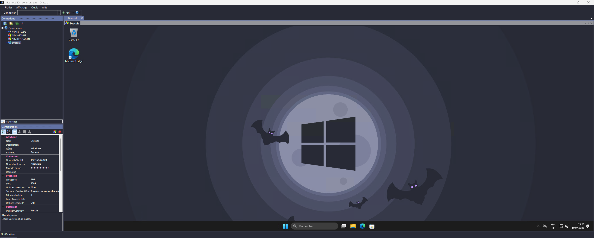

### [mRemoteNG](https://mremoteng.org/)

#### Install using Git

If you are a git user, you can install the theme and keep up to date by cloning the repo:

```bash
git clone https://github.com/dracula/mremoteng.git
```

#### Install manually

Download the [`Dracula.vstheme`](./Dracula.vstheme) file directly, or use the [GitHub `.zip` download](https://github.com/dracula/mremoteng/archive/main.zip) option and unzip it.

#### Activating theme

##### Step 1: Locate the Themes folder

1. Open your mRemoteNG installation folder;
2. Locate the `Themes` subfolder:
   - Installed version: `%ProgramFiles(x86)%\mRemoteNG\Themes`
   - Portable version: `<mRemoteNG folder>\Themes`

##### Step 2: Copy the theme file

1. Copy `Dracula.vstheme` from this repository;
2. Paste it into the `Themes` folder located in Step 1.

##### Step 3: Enable and select the theme

1. Launch mRemoteNG;
2. Go to **Tools > Options > Theme**;
3. Check **Enable Themes** if it isn't already checked;
4. Select **Dracula** from the theme list;
5. Restart mRemoteNG so the theme applies fully to every panel:

<p align="center">
  
</p>

> The installation is now complete, and the theme is correctly integrated. ✨

#### Notes

- A few native Windows controls (e.g. some buttons/group boxes on the **Notifications** options page) are not covered by mRemoteNG's own theming system and keep the default Windows look regardless of the selected theme — this is a limitation of mRemoteNG itself, not of this theme.
